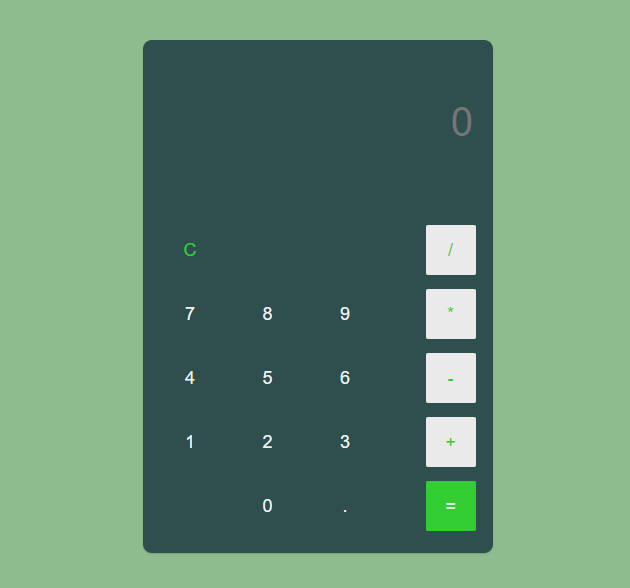

<h1>Calculadora :computer:</h1>

<h1>Description and Funcionalities</h2>
This project is a simple calculator that performs operations with just two numbers.
It was developed in:

<ul>
  <li>HTML</li>
  <li>CSS</li>
   <li>JavaScript</li>

</ul>

<h2>How to use :books:</h2>
To have this project at home, you need to install some IDE, such as Visual Studio Code, Notepad++ 
or a simple notepad.Save and open.

<h2>Funcionalities :label:</h2>

<h2>Authors</h2>
Giovanna Cruz dos Santos.
Blog do mat
